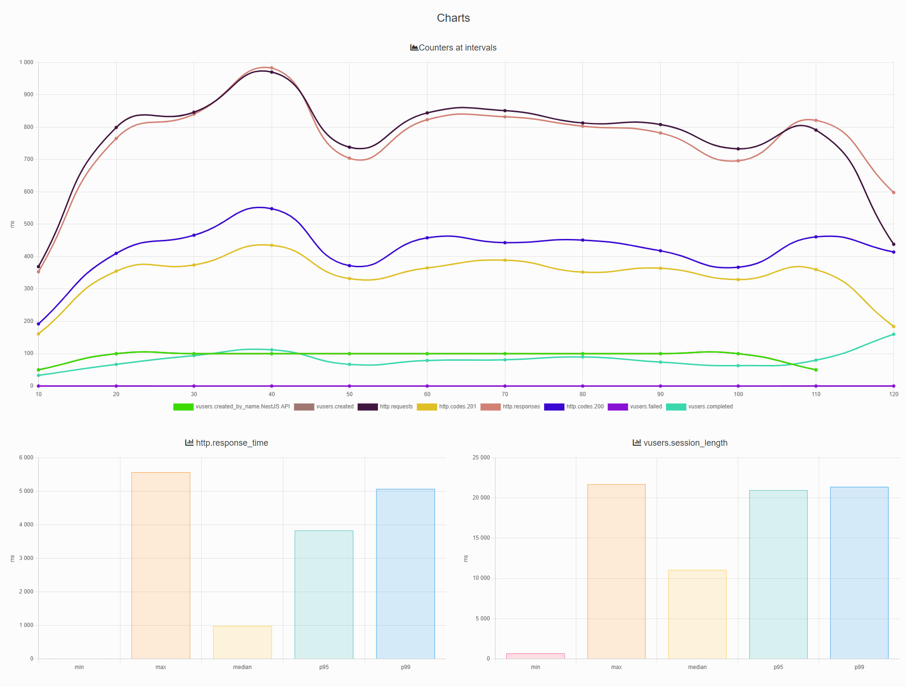
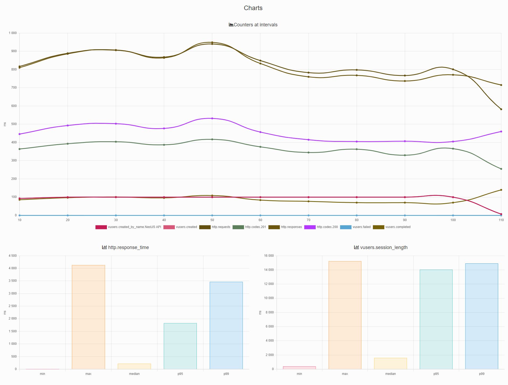

<p align="center">
  <a href="http://nestjs.com/" target="blank"></a>
</p>

[circleci-image]: https://img.shields.io/circleci/build/github/nestjs/nest/master?token=abc123def456
[circleci-url]: https://circleci.com/gh/nestjs/nest

  <p align="center">A progressive <a href="http://nodejs.org" target="_blank">Node.js</a> framework for building efficient and scalable server-side applications.</p>
    <p align="center">
<a href="https://www.npmjs.com/~nestjscore" target="_blank"></a>
<a href="https://www.npmjs.com/~nestjscore" target="_blank"></a>
<a href="https://www.npmjs.com/~nestjscore" target="_blank"></a>
<a href="https://circleci.com/gh/nestjs/nest" target="_blank"></a>
<a href="https://coveralls.io/github/nestjs/nest?branch=master" target="_blank"></a>
<a href="https://discord.gg/G7Qnnhy" target="_blank"></a>
<a href="https://opencollective.com/nest#backer" target="_blank"></a>
<a href="https://opencollective.com/nest#sponsor" target="_blank"></a>
  <a href="https://paypal.me/kamilmysliwiec" target="_blank"></a>
    <a href="https://opencollective.com/nest#sponsor"  target="_blank"></a>
  <a href="https://twitter.com/nestframework" target="_blank"></a>
</p>
  <!--[](https://opencollective.com/nest#backer)
  [](https://opencollective.com/nest#sponsor)-->

## Description

[Nest](https://github.com/nestjs/nest) framework TypeScript starter repository. <br>
[Docker](https://www.docker.com/get-started) download Docker

## Downloading

```
git clone {repository URL}
```

## Installation

```bash
$ npm install
```

## Running the app

```bash
# development
$ npm run start

# watch mode
$ npm run start:dev

# production mode
$ npm run start:prod
```

## Lint

```
npm run lint
```

## FileUpload

To upload file use route : "/files". <br>
Restrictions: 5MB to file. <br>
Multiply upload support: Yes.

## Docker

For use ready build

```
docker-compose pull node-app
docker-compose pull postgres
```

or new build

```
docker-compose build
```

For start container use

```
docker-compose up -d
```

For shutdown container use

```
docker-compose down
```

App can be switched between Express and Fastify.<br>
To do this :

1. docker-compose down node-app
2. change env USE_FASTIFY
3. docker-compose up -d node-app

```
 environment:
      TYPEORM_HOST: postgres
      USE_FASTIFY: false
```

## PostgreSQL and pgAdmin

`DB` : fastify-db <br>
`Tables` :

- Users
- Tasks
- Boards

`Migrations` <br>

CLI migrations

```
npm run typeorm
```

For auto generate migrations

```
npm run typeorm:generate
```

If migrations changes

```
npm run typeorm:run
```

Docker-compose contains image dpage/pgadmin4 => [pgAdmin](https://www.pgadmin.org/). <br>
To access pgadmin from docker go to [http://localhost:5050](http://localhost:5050). <br>
email : `admin@admin.com` <br>
password: `root` <br>

To work with the pgAdmin in docker, use the next flow:

1. Authorization (admin@admin.com / root)
2. Add new server

   - Enter anything connection name
   - Host `postgres`
   - Username from .env file
   - Password from .env file

3. Browse servers

## Logger

For change level logs need go to env file and change

```
LOG_LEVEL
```

levels logs :

- 0: error
- 1: warn
- 2: info
- 3: debug
- 4: all

if level log === 0, all errors logs write in errorLog.log

## Test

```bash
# unit tests
$ npm run test

# e2e tests
$ npm run test:e2e

# test coverage
$ npm run test:cov
```

## Benchmark

In project used [Artillery](https://www.artillery.io/)

# Express

```
http.codes.200: ................................................................ 5000
http.codes.201: ................................................................ 4000
http.request_rate: ............................................................. 80/sec
http.requests: ................................................................. 9000
http.response_time:
  min: ......................................................................... 4
  max: ......................................................................... 5565
  median: ...................................................................... 982.6
  p95: ......................................................................... 3828.5
  p99: ......................................................................... 5065.6
http.responses: ................................................................ 9000
vusers.completed: .............................................................. 1000
vusers.created: ................................................................ 1000
vusers.created_by_name.NestJS API: ............................................. 1000
vusers.session_length:
  min: ......................................................................... 689.9
  max: ......................................................................... 21694.1
  median: ...................................................................... 11050.8
  p95: ......................................................................... 20958.1
  p99: ......................................................................... 21381.5
```



# Fastify

```
http.codes.200: ................................................................ 5000
http.codes.201: ................................................................ 4000
http.request_rate: ............................................................. 83/sec
http.requests: ................................................................. 9000
http.response_time:
  min: ......................................................................... 1
  max: ......................................................................... 4129
  median: ...................................................................... 219.2
  p95: ......................................................................... 1826.6
  p99: ......................................................................... 3464.1
http.responses: ................................................................ 9000
vusers.completed: .............................................................. 1000
vusers.created: ................................................................ 1000
vusers.created_by_name.NestJS API: ............................................. 1000
vusers.session_length:
  min: ......................................................................... 401.9
  max: ......................................................................... 15226
  median: ...................................................................... 1587.9
  p95: ......................................................................... 14048.5
  p99: ......................................................................... 14917.2
```



## Support

Nest is an MIT-licensed open source project. It can grow thanks to the sponsors and support by the amazing backers. If you'd like to join them, please [read more here](https://docs.nestjs.com/support).

## Stay in touch

- Author - [Kamil Myśliwiec](https://kamilmysliwiec.com)
- Website - [https://nestjs.com](https://nestjs.com/)
- Twitter - [@nestframework](https://twitter.com/nestframework)

## License

Nest is [MIT licensed](LICENSE).
